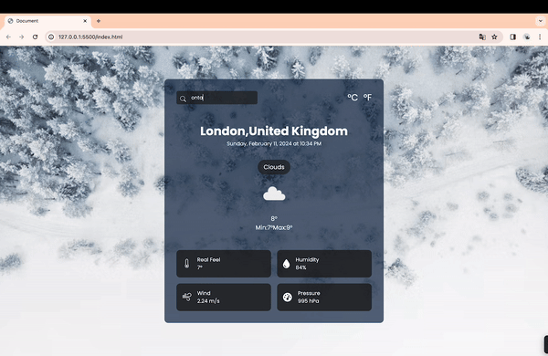

<h1> weatherApp </h1>

This JavaScript application is a weather app developed using the OpenWeather API. It aims to dynamically fetch and display current weather information based on the user's selected city, with a visually appealing interface.

<h2> The technologies used in the project </h2>

It was coded using Html, Css and JavaScript technologies.

<h2> Demo </h2>

You can view a live demo of this project [here](https://seliinatmaca.github.io/weatherApp/).

<h2> Screenshot </h2>

